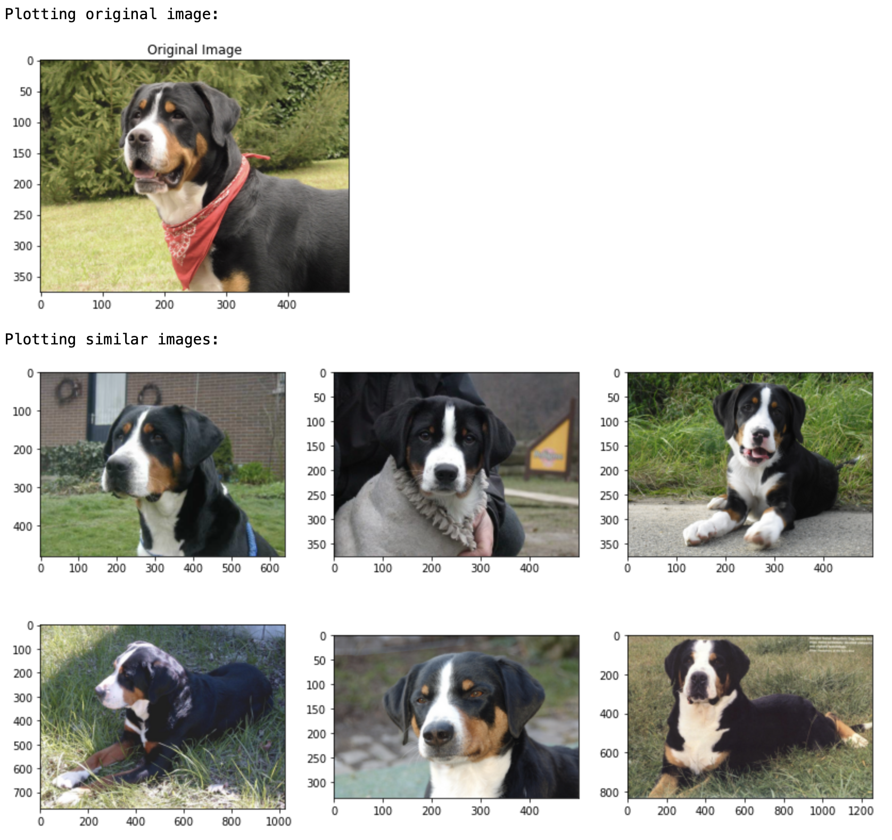

# Zilliz/Milvus Coding Assignment


In this coding assignment, I will show how to extract similar images using `python` and `milvus`. Embeddings for the entire ImageNet dataset have been generated using the ResNet50 architecture and will be pushed into a `milvus` collection called `imagenet_collection`. 

The `notebooks` directory contains the `1_End_to_End_Milvus_Image_Similarity_Example.ipynb` notebook which goes step by step on how to build the collection from scratch and how to do it for your very own directory of images easily. By the end, you'll learn how to use these utilities to extract images and plot them. For example:

<p align="center">
  
</p>

# Documentation

I invite you to take a look at the `utilities` directory, which contains the documented utilities functions and classes that help create your image similarity system faster. For convenience, I quickly generated documentation for the functions used here using `pdoc3`. 

- <a href="https://pedrojrv.github.io/milvus_image_retrieval/">Milvus Utilities Documentation</a>

# Before you Begin

Make sure you have successfully pulled the `milvus` docker image using:

```docker
docker pull milvusdb/milvus:1.0.0-cpu-d030521-1ea92e
```

Next, clone this repository to a directory of your choice using `git`:

```bash
git clone https://github.com/pedrojrv/milvus_image_retrieval.git
```

Once cloned, copy and paste the following in your terminal but remember to change the path to the location of your `milvus_image_retrieval` directory.

```bash
docker run -d --name milvus_cpu_1.0.0 \
-p 19530:19530 \
-p 19121:19121 \
-v /path/to/the/repository/milvus_image_retrieval/db:/var/lib/milvus/db \
-v /path/to/the/repository/milvus_image_retrieval/conf:/var/lib/milvus/conf \
-v /path/to/the/repository/milvus_image_retrieval/logs:/var/lib/milvus/logs \
-v /path/to/the/repository/milvus_image_retrieval/wal:/var/lib/milvus/wal \
milvusdb/milvus:1.0.0-cpu-d030521-1ea92e
```

You can make sure your `milvus` server is up and running by typing `docker ps` in the terminal and reading the output.

Next, open `jupyter notebooks` from your favorite python environment and read through the `1_End_to_End_Milvus_Image_Similarity_Example.ipynb` image retrieval use case and code. I hope you enjoy it as much as I did while developing this example. 

# Suggestions

- The `/home/` directory in MacOS is forbidden even with administrator privileges. At first, the documentation seems to indicate that the user must use this directory. It would be nice to mention that the path is flexible (especially for Windows).
- It would be nice to have more interactive examples for image similarity or document retrieval with toy datasets. These use cases can help people get started faster. I found a couple of them on Medium afterward which was nice. 
- For both text and image vectors, I would suggest developing some utility functions for not only extracting but transferring near/matched files to the desired location. For example, downloading the top_k nearest images rather than just obtaining the Milvus ids.
- In general, I feel like Milvus has the potential to provide an even more seamless transition from data to vector database if more utility functions are developed to support different data types out of the box.
- Spacy, an NLP, the library provides pre-trained models for text embedding generation. A suggestion for Milvus would be to have a couple of pre-trained models for image, text, etc. embedding generation on the fly.
- In my example, I had to keep track of the (milvus id, image_path) relationship using a pandas DataFrame. This can be done using a SQL database or any other database type but it would be nice if Milvus provides a way to also include user-provided metadata information including image URLs, string-like file paths, etc.  I could not find any labeling functionality other than an option to manually provide ids. 
- The`client.count_entities(collection_name)` may take a couple of seconds to update for large insertions. I sometimes ran into an error with quick assertions since the code was not giving time to Milvus to update.  
- A functionality to download the files corresponding to the nearest neighbors can be useful. I implemented an example in the `milvus_utilities.py` file. 


# Bugs in Webpage

1. The `example code` link in the `Hello Milvus` page (https://milvus.io/docs/example_code.md) is broken. 

```
If you cannot use wget to download the example code, you can also create example.py and copy the example code.
```

The hyperlink is https://github.com/milvus-io/pymilvus/blob/1.0.1/examples/example.py. The correct link should be https://github.com/milvus-io/pymilvus/blob/master/examples/example.py.

2. The link for the `sizing tool` (https://zilliz.com/sizing-tool/) in the `connect_milvus_python.md` (https://milvus.io/docs/v1.0.0/connect_milvus_python.md) page blue box is broken. Got a `404 Not Found` error.

```
See Python API documentation for details about APIs.
We recommend using Milvus Sizing Tool to estimate the hardware resources required for the data.
```

3. Most of the links in the API reference are broken: https://pymilvus.readthedocs.io/en/latest/api.html#

For example, the `create_index` documentation link seems to be broken: https://pymilvus.readthedocs.io/en/latest/api.html#milvus.Milvus.create_index


<!-- ```bash
docker run -d --name milvus_cpu_1.0.0 \
-p 19530:19530 \
-p 19121:19121 \
-v /Users/pedrovicentevaldez/Desktop/milvus_image_retrieval/db:/var/lib/milvus/db \
-v /Users/pedrovicentevaldez/Desktop/milvus_image_retrieval/conf:/var/lib/milvus/conf \
-v /Users/pedrovicentevaldez/Desktop/milvus_image_retrieval/logs:/var/lib/milvus/logs \
-v /Users/pedrovicentevaldez/Desktop/milvus_image_retrieval/wal:/var/lib/milvus/wal \
milvusdb/milvus:1.0.0-cpu-d030521-1ea92e


docker run -d --name milvus_cpu_1.0.0 ^
-p 19530:19530 ^
-p 19121:19121 ^
-v C:/Users/Pedro/Desktop/milvus_image_retrieval/db:/var/lib/milvus/db ^
-v C:/Users/Pedro/Desktop/milvus_image_retrieval/conf:/var/lib/milvus/conf ^
-v C:/Users/Pedro/Desktop/milvus_image_retrieval/logs:/var/lib/milvus/logs ^
-v C:/Users/Pedro/Desktop/milvus_image_retrieval/wal:/var/lib/milvus/wal ^
milvusdb/milvus:1.0.0-cpu-d030521-1ea92e
``` -->